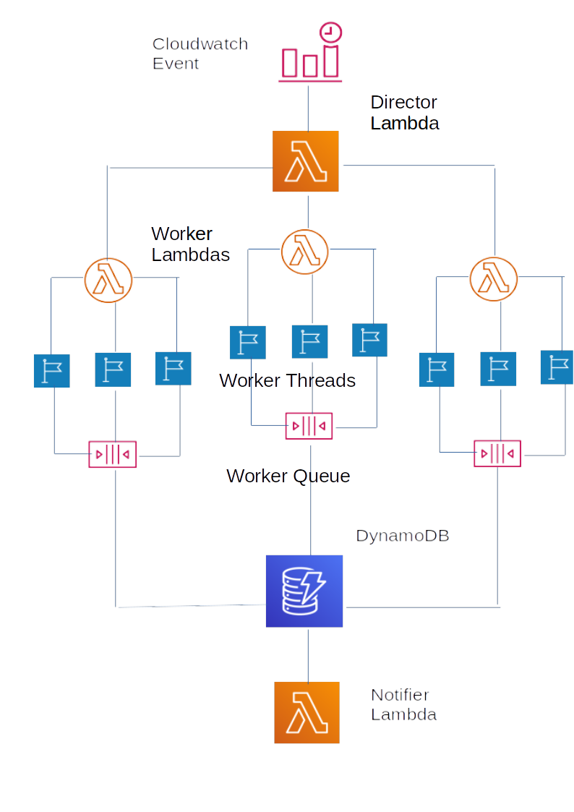

# Director Lambda Architecture

While managing more than one AWS account you collect lots of scripts on your personal machine that generate information about
your infrastructure.  The temptation is to lift and shift these scripts wholesale to EC2 or ECS.  This is both costly and
inefficient, as is running them wholly from your laptop.

Here is a method that is both cheap and efficient and because of this efficiency is both fast and light on resources.  The
architecture presented here is designed for python (3.6+) though is easily translatable into one of the many run-times that AWS
Lambda supports.

* A Cloudwatch event rule (probably a cron rule) kicks the whole thing off by triggering a Director Lambda Function.
* The Director Lambda Function obtains a list of Regions and the list of accounts that you wish to interrogate.
* The Director asynchronously triggers an invocation of a Worker Lambda Function, one per account, passing in the account details
  as part of the Event Dictionary the Worker will receive. The Director's work is now complete.
* The Worker will setup a thread per region, with a target of the script that you wish to run.
* The Worker assumes a pre-defined role in the target account and region.
* The Worker creates an internal Queue object that is shared amongst all threads; this will receive the data that is being
  collected.
* As each Worker thread runs to completion the Worker dumps the contents of the Queue into a DynamoDB table adding in any extra
  fields that may be required like account id, account name, region and maybe a TTL.
* Metrics can be collected and sent on to Cloudwatch or 3rd. Party systems like Wavefront.
* Separately, a Notifier Lambda Function can take the contents of the DynamoDB table and format them into a suitable message e.g.
  for a Slack Channel or an email.

Using this architecture on 120 accounts with 16 regions in each account, this runs to completion in a little over 20 seconds
(without the DynamoDB updates) though that would depend on the work the Worker functions have to do.  AWS takes care of the
DynamoDB update queue which will obviously extend the time taken to run (though as it is in essence a post to an SNS endpoint, it
doesn't take too long even if you have thousands of updates to post).

The only thing left to manage is the memory size you give your Lambda functions.  I've found that the Workers require between 256
and 512 MB of memory to prevent premature function killing due to memory exhaustion.  With 120 accounts the Director is
comfortable with 256MB, though the default of 128MB is leaving things a little tight.

